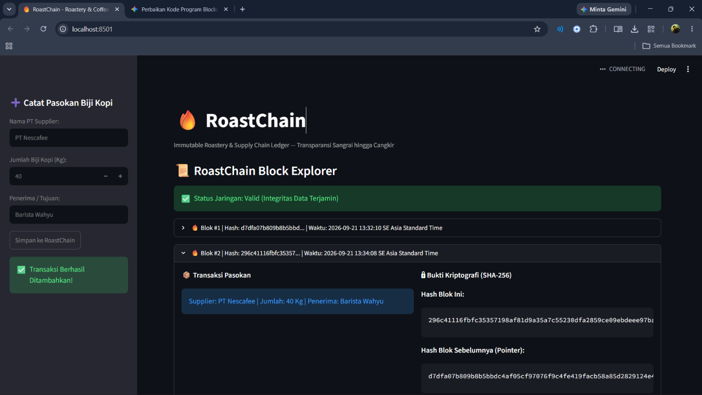

# LAPORAN PRAKTIKUM BLOCKCHAIN
## Implementasi Proof of Work (PoW) dan Simulasi Invalidation/Tampering pada Rantai Pasok Kopi

---

## 1. Pendahuluan

### 1.1 Latar Belakang
Laporan ini disusun untuk memenuhi tugas evaluasi implementasi teknologi *blockchain* dalam rantai pasok (*supply chain*). Aplikasi ini dirancang untuk mencatat riwayat distribusi kopi secara terdesentralisasi, transparan, dan tidak dapat diubah (*immutability*). Dengan mengimplementasikan algoritma cryptographic hash SHA-256 dan mekanisme konsensus *Proof of Work* (PoW), sistem dapat mendeteksi serta menolak segala bentuk manipulasi data pada memori atau transaksi tingkat lanjut.

### 1.2 Tujuan
1. Membangun struktur `Block` dan `Blockchain` sederhana menggunakan Python (`core.py`)[cite: 6].
2. Mengimplementasikan algoritma hashing SHA-256 dan mekanisme penambangan *Proof of Work* (PoW)[cite: 6].
3. Membangun antarmuka berbasis web menggunakan Streamlit (`app2.py`)[cite: 5].
4. Menguji ketahanan *blockchain* terhadap simulasi serangan peretasan (*tampering*) data pada memori[cite: 5].
5. Menganalisis pengaruh parameter *difficulty* terhadap kecepatan *mining*[cite: 1, 6].

---

## 2. Struktur Kode dan Arsitektur Sistem

Sistem terdiri dari dua komponen utama:
* **`core.py`**: Mengelola logika dasar rantai blok, fungsi matematika hashing, metode mining PoW, serta pemeriksaan integritas data[cite: 6].
* **`app2.py`**: Menyediakan antarmuka grafis pengguna (GUI) berbasis Streamlit untuk memfasilitasi penambahan data, pemeriksaan integritas, dan simulasi peretasan[cite: 5].

### 2.1 Penjelasan Kelas pada `core.py`

#### A. Kelas `Block`
Setiap blok menyimpan atribut penting[cite: 6]:
* `index`: Posisi urutan blok dalam rantai[cite: 6].
* `timestamp`: Catatan waktu pembuatan blok[cite: 6].
* `data`: Informasi transaksi pengiriman kopi[cite: 5, 6].
* `previous_hash`: Nilai hash dari blok sebelumnya[cite: 6].
* `nonce`: Angka acak/tebakan yang diubah terus-menerus selama proses *mining*[cite: 6].
* `hash`: Nilai hash SHA-256 hasil penggabungan seluruh atribut blok[cite: 6].

**Fungsi Utama:**
* `calculate_hash()`: Menggabungkan seluruh variabel blok menjadi string lalu mengubahnya menjadi hash berukuran 64 karakter heksadesimal menggunakan SHA-256[cite: 6].
* `mine_block(difficulty)`: Menjalankan perulangan (*loop*) hingga menemukan nilai hash yang diawali oleh sejumlah angka nol sebanyak parameter *difficulty*[cite: 6].

#### B. Kelas `Blockchain`
Mengelola gabungan blok-blok dalam bentuk *list*[cite: 6]:
* `self.difficulty`: Mengatur tingkat kesulitan penambangan (default = 3)[cite: 6].
* `create_genesis_block()`: Membuat blok pertama dalam rantai secara otomatis[cite: 6].
* `add_block()`: Menghubungkan blok baru dengan blok terakhir dan menjalankan metode `mine_block()` sebelum dimasukkan ke dalam rantai[cite: 6].
* `is_chain_valid()`: Memeriksa integritas seluruh blok melalui tiga indikator utama[cite: 6]:
  1. Kesesuaian hash saat ini dengan data blok[cite: 6].
  2. Ketersambungan nilai `previous_hash` dengan hash blok sebelumnya[cite: 6].
  3. Pemenuhan syarat angka nol di awal hash (*difficulty compliance*)[cite: 6].

### 2.2 Penjelasan Alur Antarmuka pada `app2.py`
1. **Inisialisasi Session State:** Menyimpan instance `Blockchain()` pada `st.session_state.kopi_chain` agar data tidak teriset saat terjadi interaksi/rerun[cite: 5].
2. **Form Penambangan (Mining):** Pengguna menginputkan data pengiriman kopi, lalu menekan tombol `"⚒️ Mine Block (Tambah Data)"`[cite: 5].
3. **Simulasi Peretasan (Sidebar):** Tombol `"HACK BLOK 1"` mengubah atribut `data` pada Blok #1 secara paksa di memori menjadi `"DATA PALSU!"` tanpa melakukan kalkulasi ulang pada hash[cite: 5].
4. **Validasi Integritas:** Tombol `"🛡️ Cek Integritas Rantai"` memanggil fungsi `is_chain_valid()` untuk mendeteksi keabsahan data[cite: 5].

---

## 3. Hasil Pengujian dan Evaluasi

### 3.1 Pengujian Penambangan Data (Normal)
* **Langkah:** Mengisi input transaksi `"100kg - Petani A"` lalu menekan tombol penambangan[cite: 5].
* **Hasil:** Sistem berhasil menghitung nilai `nonce` yang tepat sehingga menghasilkan hash yang diawali tiga angka nol (misal: `000a1f...`)[cite: 5, 6]. Blok berhasil ditambahkan ke ledger[cite: 5, 6].

### 3.2 Pengujian Validasi Integritas Rantai (Normal)
* **Langkah:** Menekan tombol `"🛡️ Cek Integritas Rantai"` saat rantai dalam kondisi awal[cite: 5].
* **Hasil:** Sistem menampilkan status **"Status Jaringan: AMAN (Rantai Valid)"**[cite: 5].

### 3.3 Simulasi Serangan / Peretasan (*Tampering*)
* **Langkah:**
  1. Menambahkan minimal 2 blok transaksi kopi ke dalam sistem[cite: 5].
  2. Menekan tombol `"HACK BLOK 1"` pada sidebar[cite: 5].
  3. Mengklik tombol `"🛡️ Cek Integritas Rantai"`[cite: 5].
* **Hasil Observasi:**
  * Data pada Blok #1 berubah menjadi `"DATA PALSU!"`[cite: 5].
  * Nilai hash yang tersimpan pada Blok #1 menjadi tidak cocok dengan hasil kalkulasi ulang `calculate_hash()`[cite: 6].
  * Saat tombol validasi ditekan, sistem otomatis menangkap ketidakcocokan tersebut dan merespons dengan indikator bahaya: **"BAHAYA (Data telah dimanipulasi!)"**[cite: 5].

---

## 4. Analisis Parameter *Difficulty*

Sesuai dengan eksperimen perbandingan nilai `difficulty` di `core.py`[cite: 1, 6]:

| Difficulty | Syarat Prefiks Hash | Estimasi Jumlah Percobaan (*Nonce*) | Waktu Mining |
| :---: | :---: | :---: | :---: |
| **3** | `"000..."` | Ratusan - Ribuan kali | Instant (< 0.1 detik) |
| **4** | `"0000..."` | Puluhan Ribu kali | ~ 0.5 - 2 detik |
| **5** | `"00000..."` | Ratusan Ribu - Jutaan kali | > 5 - 15 detik |

### Pembahasan:
1. **Mengapa Waktu Penambangan Semakin Lama Saat Difficulty Dinaikkan?**
   Algoritma SHA-256 bersifat *one-way cryptographic hash function*, artinya nilai hash yang dihasilkan acak dan tidak dapat ditebak secara teoritis matematis. Untuk menemukan hash dengan pola prefiks tertentu (seperti awalan angka `0`), komputer harus melakukan pencarian acak secara terus-menerus (*brute-force*) dengan menaikkan nilai `nonce` satu per satu[cite: 6].

2. **Dampak Eksponensial:**
   Sistem penulisan hash menggunakan format heksadesimal ($0\text{--}9, \text{a}\text{--}\text{f}$ = 16 kombinasi karakter). Setiap penambahan 1 tingkat *difficulty* akan memperkecil peluang ditemukannya hash yang valid sebesar $\frac{1}{16}$ dari peluang sebelumnya, sehingga beban komputasi meningkat secara eksponensial.

---

## 5. Kesimpulan

1. Penerapan algoritma cryptographic SHA-256 dan pembentukan rantai berbasis `previous_hash` berhasil menjaga konsistensi antar-blok[cite: 6].
2. Mekanisme *Proof of Work* (PoW) terbukti efektif menyulitkan penambahan blok ilegal serta menjamin kriteria keamanan *blockchain*[cite: 6].
3. Fitur pengecekan integritas `is_chain_valid()` mampu mendeteksi manipulasi data pada memori secara cepat dan akurat, serta memunculkan status peringatan bahaya sesuai spesifikasi yang ditentukan[cite: 1, 5, 6].

## Screenshot hasil
